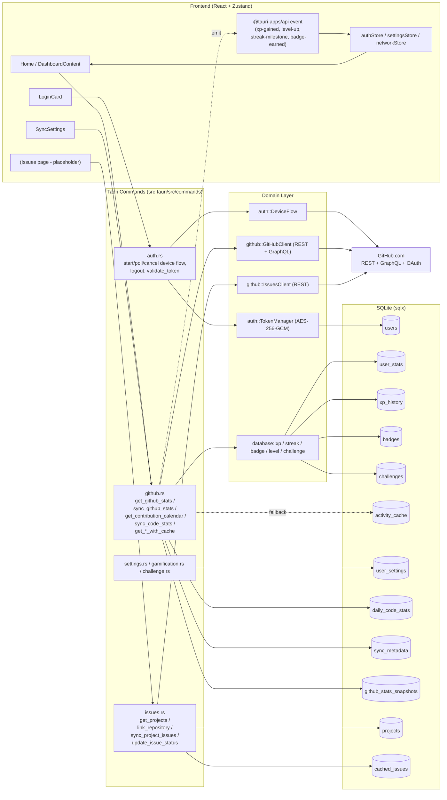

# GitHub 連携 現状調査レポート

- **調査日**: 2026-04-25
- **関連 Issue**: [#176 GitHub 連携の現状調査](https://github.com/otomatty/development-tools/issues/176)
- **ドラフト元**: `docs/01_issues/open/2026_04/20260425_02_audit_github_integration.md`
- **調査範囲**: `src-tauri/src/{auth,github,commands,database}` および `src/{stores,lib,components,pages}` のうち GitHub 連携に関わる箇所
- **非スコープ**: 新規 API 呼び出しの実装、パフォーマンス改善・リファクタリング、認証フローの再設計

---

## 1. 現状サマリ

UX 再設計（活動可視化／ゲーミフィケーション／Issue 管理）に必要な「現状把握」を最優先に、次の 6 観点で棚卸しした結果が次の通り。

| 観点 | 状態 | 主要な発見 |
| --- | --- | --- |
| 認証 | 実装済 | GitHub Device Flow（PKCE は不使用）。Access Token は AES-256-GCM で暗号化のうえ SQLite に保存。**リフレッシュ機構なし**（Device Flow が refresh token を発行しないため） |
| データ取得 | 実装済（最小限） | 主要 API: `/user`、`/user/repos`、`/users/{u}/events`、`/search/issues`、`/repos/{owner}/{repo}/issues`、GraphQL `contributionsCollection`、`history` |
| データモデル | 実装済 | 8 マイグレーション（v1〜v9、欠番 v4）で `users / user_stats / xp_history / badges / challenges / activity_cache / app_settings / user_settings / daily_code_stats / sync_metadata / github_stats_snapshots / projects / cached_issues` を定義 |
| 同期戦略 | **部分的に実装** | 手動同期（`sync_github_stats`）と起動時キャッシュ掃除のみ。`sync_interval_minutes / background_sync / sync_on_startup` 設定は **DB に保存されるが、スケジューラ未実装** |
| XP/バッジ/ストリーク | 実装済（仕様と差異あり） | XP 値は Issue 記載の仕様（コミット +10 / PR +30 / PR マージ +50 / Issue 作成 +15 / Issue 解決 +40 / レビュー +25）と **実装値が一致しない**（後述 §6） |
| エラー/障害 | 部分的に対応 | 401・404・429（rate limit）・GraphQL エラー型は分離済。**ネットワーク／レート制限時のみキャッシュフォールバック**。リポジトリ削除時のクリーンアップは未実装 |

> ✅ = UX 再設計のためのデータが取得できている
> ⚠️ = 取得しているが UI 側の活用または整合性に課題あり
> ❌ = データが取得されておらず、再設計時に追加実装が必要

| 領域 | 取得できているデータ | 状態 |
| --- | --- | --- |
| 「総コミット数 / 総 PR 数 / 総レビュー数 / 総 Issue 数 / Star 数 / コントリビューション総数」 | `GitHubStats` | ✅ |
| 「現在 / 最長 / 週次 / 月次ストリーク」 | GraphQL `contributionCalendar` から計算 | ✅ |
| 「日別 additions / deletions / commits_count」 | `daily_code_stats`（最大 100 リポジトリ） | ✅（直近 30 日／強制同期で 90 日） |
| 「前日比サマリ（commits_diff など）」 | `github_stats_snapshots` ＋ `StatsDiff` | ✅ |
| 「リポジトリ単位の Issue 一覧（カンバン用）」 | `cached_issues` | ✅（手動同期のみ） |
| 「未着手 Issue の優先度付き取得」 | ラベルから抽出（`priority:p0`〜`p3`） | ⚠️ ラベル運用が前提 |
| 「今日のコミット数（リアルタイム）」 | GraphQL の `contributionCalendar` 内日別カウントから取得可（粒度は 1 日） | ⚠️ GitHub の集計反映に遅延あり |
| 「未着手 Issue の通知」 | （取得しているが UI 未実装） | ❌ UI 未実装 |
| 「アサインされた Issue / Review Request」 | API 呼び出し未実装 | ❌ |
| 「Pomodoro / セッション計測」 | 全体未実装 | ❌ |
| 「アクティビティ・タイムライン（events 詳細）」 | `get_user_events` は実装済だが UI 未利用 | ❌ |

---

## 2. API 呼び出しマップ

### 2.1 認証系

| Tauri コマンド | 呼び出す GitHub API | 取得するデータ | 呼び出しタイミング | キャッシュ |
| --- | --- | --- | --- | --- |
| `start_device_flow` | `POST https://github.com/login/device/code` | `device_code`, `user_code`, `verification_uri`, `expires_in`, `interval` | ログインボタン押下時（`LoginCard.onLogin`） | なし |
| `poll_device_token` | `POST https://github.com/login/oauth/access_token` (`grant_type=urn:ietf:params:oauth:grant-type:device_code`) | `access_token` | 認証コード入力後の 5 秒間隔ポーリング（フロントエンド `setInterval`） | なし |
| `validate_token` | `GET /user` | HTTP 成否のみ | フロントエンドからの任意呼び出し（現状未使用） | なし |
| `complete_device_login`（内部） | `GET /user` | `GitHubUser` | ログイン直後（`poll_device_token` 成功時） | なし |

スコープ（`DeviceFlowConfig`）: `read:user`, `repo`, `read:org`。
クライアント ID は環境変数 `GITHUB_CLIENT_ID` から `lib.rs` の `setup` で読み込み。

### 2.2 統計・ゲーミフィケーション系（`commands/github.rs`）

| Tauri コマンド | 呼び出す GitHub API | 取得するデータ | タイミング | キャッシュ |
| --- | --- | --- | --- | --- |
| `get_github_user` | REST `GET /user` | `GitHubUser`（ID / login / avatar_url 等） | フロントから明示的に呼び出し | なし |
| `get_github_stats` | 下記「`get_user_stats` 集約」一式 | `GitHubStats`（コミット・PR・Issue・Stars・ストリーク・言語数等） | `Home` マウント時（`Promise.all`） | なし（直接 API） |
| `get_github_stats_with_cache` | 上記 + `activity_cache` から `github_stats` キー復元 | `CachedResponse<GitHubStats>` | フロントから明示呼び出し（**現状ホーム画面では未使用**） | 30 分。HTTP/レート制限時のみキャッシュフォールバック |
| `get_user_stats` | （DB のみ） | `UserStats`（XP・level・streak・累計） | Home マウント時 | DB 自体が永続化 |
| `get_user_stats_with_cache` | （DB → activity_cache） | `CachedResponse<UserStats>` | フロントから明示呼び出し | 60 分 |
| `sync_github_stats` | 上記「`get_user_stats` 集約」+ DB 更新 | `SyncResult`（XP 内訳、レベルアップ、ストリークボーナス、新バッジ、前日比） | 設定画面の「今すぐ同期」ボタン | スナップショットを `github_stats_snapshots` に保存（前日比計算用） |
| `get_contribution_calendar` | GraphQL `contributionsCollection.contributionCalendar` | 53 週 × 7 日の `contributionCount` / `date` / `weekday` | `ContributionGraph` 表示時 | なし（毎回 GraphQL） |
| `get_badges_with_progress` | 上記「`get_user_stats` 集約」 + DB | 各バッジの進捗率 | `BadgeGrid` で利用 | なし |
| `get_near_completion_badges` | 同上 | 50% 以上進捗のバッジ | フロントから任意 | なし |
| `sync_code_stats` | GraphQL `repositories.history(first:100,since)` を最大 100 リポジトリ分 | `CodeStatsSyncResult`（日別 additions/deletions） | フロントから任意 | `daily_code_stats` に永続化、`sync_metadata` で 6 時間スロットル |
| `get_code_stats_summary` | （DB のみ） | `CodeStatsResponse`（週・月・四半期・年） | フロントから任意 | DB |
| `get_rate_limit_info` | REST `GET /rate_limit` ＋ GraphQL `rateLimit` | `RateLimitDetailed`（core / search / graphql） | フロントから任意 | なし |
| `get_cache_stats` / `clear_user_cache` / `cleanup_expired_cache` | （DB のみ） | キャッシュ件数・削除件数 | 設定画面 + 起動時クリーンアップ | DB |

#### `get_user_stats` 集約（`github::client::GitHubClient::get_user_stats`）の内訳

`Home` で 1 回・`sync_github_stats` で 1 回・`get_badges_with_progress` 等で都度呼ばれる「集約 API」が、内部で下記を **直列に** 叩く点が要注意。

| 順序 | エンドポイント | 種別 | 用途 | レート制限カテゴリ |
| --- | --- | --- | --- | --- |
| 1 | GraphQL `contributionsCollection` | GraphQL | 総コミット / PR / Issue / Review、コントリビューションカレンダー、ストリーク計算用日別データ | GraphQL 5,000 pt/h |
| 2 | REST `GET /user/repos?sort=updated&per_page=100&page=1` | REST | Star 数集計、言語数集計 | Core 5,000 req/h |
| 3 | REST `GET /search/issues?q=type:pr+author:{user}` | REST (Search) | 累計 PR 数 | **Search 30 req/min** |
| 4 | REST `GET /search/issues?q=type:pr+author:{user}+is:merged` | REST (Search) | マージ済 PR 数 | Search |
| 5 | REST `GET /search/issues?q=type:issue+author:{user}+is:closed` | REST (Search) | クローズ済 Issue 数 | Search |

> Search API がレート制限に達した場合は GraphQL 値（`totalPullRequestContributions`）または `0` にフォールバックする実装あり（`client.rs` 537-582）。ただし「マージ済 PR」「クローズ済 Issue」は **GraphQL 等価値が取得できないため `0`** に落ちる。

### 2.3 Issue / プロジェクト系（`commands/issues.rs` ＋ `github::issues::IssuesClient`）

| Tauri コマンド | 呼び出す GitHub API | 取得するデータ | タイミング | キャッシュ |
| --- | --- | --- | --- | --- |
| `get_user_repositories` | REST `GET /user/repos?per_page=100&sort=updated` | リポジトリ一覧 | プロジェクト連携時 | なし |
| `link_repository` | REST `GET /repos/{owner}/{repo}` + ラベル作成 `POST /repos/{owner}/{repo}/labels`（`status:in-progress` など） | リポジトリ情報、status ラベル | プロジェクトとリポジトリを紐付け時 | `projects.is_actions_setup` で記録 |
| `setup_github_actions` | （ローカルでテンプレ生成） | Actions YAML 文字列 | 「Actions セットアップ」ボタン | なし |
| `sync_project_issues` | REST `GET /repos/{owner}/{repo}/issues?state=all&per_page=100&page={n}` を **1,000 件まで再帰ページング** | Issue 一覧（labels / state / state_reason / assignee 含む） | カンバン画面の「同期」ボタン | `cached_issues` に UPSERT |
| `get_project_issues` / `get_kanban_board` | （DB のみ） | カンバン用 Issue グルーピング | UI 表示時 | DB |
| `update_issue_status` | REST `PATCH /repos/{owner}/{repo}/issues/{n}`（state 変更）+ ラベル `add` / `remove` | 更新後 Issue | カンバンドラッグ時 | DB 即時更新 |
| `create_github_issue` | REST `POST /repos/{owner}/{repo}/issues` + ラベル更新 | 新規 Issue | フロントから任意 | DB |

ステータス／優先度のローカル表現:

- ステータス: `backlog / todo / in-progress / in-review / done` （ラベルから抽出。`state=closed` の場合は `state_reason` を見て `done` または `cancelled` に変換）
- 優先度: ラベル名 `priority:p0`〜`priority:p3` から抽出

### 2.4 設定 / その他

| Tauri コマンド | 呼び出す GitHub API | 補足 |
| --- | --- | --- |
| `get_settings` / `update_settings` / `reset_settings` | なし | `user_settings` テーブルを R/W |
| `get_sync_intervals` | なし | `5 / 15 / 30 / 60 / 180 / 0(手動のみ)` の固定リスト |
| `clear_cache` / `get_database_info` / `reset_all_data` / `export_data` | なし | データ管理系。`export_data` は user / stats / badges / xp_history を JSON 化 |
| `open_url` / `open_external_url` | なし | OS のブラウザ起動 |

---

## 3. データフロー図

> 注: ホーム画面（`src/pages/Home/Home.tsx`）は **`get_github_stats_with_cache` を使っていない**。`Promise.all` で `getStats / getLevelInfo / getUserStats` を直接呼ぶため、オフライン時はキャッシュにフォールバックせずエラーになる。

---

## 4. 同期戦略の現状

### 4.1 サマリ

| トリガー | 実装状況 | 備考 |
| --- | --- | --- |
| アプリ起動時の同期 (`sync_on_startup`) | ❌ 未実装 | 設定値は DB に保存されるが参照箇所なし |
| 定期同期 (`sync_interval_minutes`) | ❌ 未実装 | 同上。フロントにもバックエンドにもタイマー無し |
| バックグラウンド同期 (`background_sync`) | ❌ 未実装 | 同上 |
| 手動同期 | ✅ 実装済 | `SyncSettings` 画面の「今すぐ同期」ボタンが `github.syncStats()` (= `sync_github_stats`) を直接呼ぶ |
| イベント駆動同期 | ❌ 未実装 | GitHub Webhook はデスクトップアプリの性質上利用不可 |
| 起動時キャッシュ掃除 | ✅ 実装済 | `lib.rs::run` 内 `tauri::async_runtime::spawn(clear_expired_cache)` |

### 4.2 キャッシュ戦略の実装箇所

| キャッシュ層 | 期限 | 用途 | 対象コマンド |
| --- | --- | --- | --- |
| `activity_cache` (DB) | 30 分 | `github_stats` の障害時フォールバック | `get_github_stats_with_cache` |
| `activity_cache` (DB) | 60 分 | `user_stats` のフォールバック | `get_user_stats_with_cache` |
| `daily_code_stats` (DB) | 永続 | コード統計 | `sync_code_stats` |
| `sync_metadata` (DB) | 6 時間 | コード統計 sync 抑制 | `sync_code_stats` |
| `github_stats_snapshots` (DB) | 永続（日付 unique） | 前日比 | `sync_github_stats` |
| `cached_issues` (DB) | 永続 | カンバン用 Issue | `sync_project_issues` |
| 旧 `previous_github_stats` (KV) | 永続 | XP 計算用「前回 sync 値」 | `sync_github_stats` |

> Stale-While-Revalidate 的な構造は **未実装**。`get_github_stats_with_cache` は「API 失敗時のみキャッシュを返す」のみで、表示中はキャッシュを即返してバックグラウンドで再検証……という挙動にはなっていない。

### 4.3 レート制限到達時のフォールバック

- `GitHubClient::get` / `graphql` 共通: 403 + `x-ratelimit-remaining: 0` を見て `GitHubError::RateLimited(reset_unix_ts)` を返す。
- `get_user_stats` 集約内: Search API の 3 呼び出しでレート制限を検知した場合、GraphQL 由来の値や `0` にフォールバック（前述）。
- `get_github_stats_with_cache`: `is_network_error` で **HttpRequest / RateLimited** のみをフォールバック対象に判定。`Unauthorized` などはフォールバックせずそのまま返す。
- `get_rate_limit_info`: REST + GraphQL の残量を返却。Search 残量は **正確に取得不能** （GitHub 側 API が無いため `30 / 30` 固定値で返している）。

---

## 5. データモデル / DB スキーマ

### 5.1 マイグレーション一覧（`database/migrations.rs`）

| version | 名前 | 主な内容 |
| --- | --- | --- |
| 1 | `initial_schema` | `users / user_stats / badges / challenges / xp_history / activity_cache / app_settings` + インデックス |
| 2 | `add_user_settings` | `user_settings`（通知 / 同期 / アニメ） |
| 3 | `add_challenge_start_stats` | `challenges.start_stats_json` |
| 4 | (欠番) | — |
| 5 | `add_code_stats_tables` | `daily_code_stats`, `sync_metadata` |
| 6 | `add_github_stats_snapshots` | `github_stats_snapshots`（前日比） |
| 7 | `add_issue_management_tables` | `projects`, `cached_issues` |
| 8 | `add_xp_history_breakdown` | `xp_history.breakdown_json` |
| 9 | `drop_legacy_static_file_server_tables` | レガシー mock server テーブルを削除（Issue #175） |

### 5.2 GitHub データとの対応関係

| テーブル | GitHub 上の対応 | 永続化／揮発 |
| --- | --- | --- |
| `users` | `GET /user`（id, login, avatar_url）+ 暗号化済 access_token | 永続 |
| `user_stats` | アプリ独自（XP・level・累計コミット等） | 永続 |
| `xp_history` | アプリ独自（同期や挑戦達成のたびに 1 行 INSERT、`breakdown_json` に内訳を JSON 保存） | 永続 |
| `badges` | アプリ独自（ID 一覧は `badge::get_all_badge_definitions`） | 永続 |
| `challenges` | アプリ独自（生成時に `start_stats_json` で当時の GitHub 統計をスナップショット） | 永続 |
| `activity_cache` | GitHub レスポンス JSON | 永続だが `expires_at` で揮発扱い |
| `daily_code_stats` | GraphQL 由来の commit history を日付集約 | 永続（Upsert） |
| `sync_metadata` | sync 種別ごとの最終時刻・カーソル・ETag・rate limit 残量 | 永続 |
| `github_stats_snapshots` | 同期日のスナップショット（前日比用） | 永続（日次 unique） |
| `projects` | リポジトリ連携情報（`github_repo_id`, `repo_owner`, `repo_name`, `is_actions_setup`） | 永続 |
| `cached_issues` | Issue（state, status, priority, labels_json, html_url など） | 永続（`cached_at` あり） |
| `user_settings` | 通知 / 同期 / アニメ設定 | 永続 |
| `app_settings` | アプリ内 KV ストア（`previous_github_stats` 等を文字列で保存） | 永続 |

> Issue 起票文では `xp_events / streaks` というテーブルが想定されているが、実装上は `xp_history` ／ `user_stats.current_streak` 等で代替されている。

### 5.3 主要モデル（型定義の場所）

- `User`, `UserStats`, `ExportData` — `database::models::user`
- `XpSource`, `XpActionType`, `XpHistoryEntry`, `XpBreakdown` — `database::models::xp`
- `BadgeRarity`, `BadgeType`, `Badge`, `BadgeDefinition`, `BadgeCondition`, `BadgeEvalContext` — `database::models::badge`
- `StreakMilestone`, `StreakBonusResult` — `database::models::streak`
- `Challenge`, `ChallengeStats`, `ChallengeType` — `database::models::challenge`
- `ActivityCache`, `cache_types`, `cache_durations` — `database::models::cache`
- `DailyCodeStats`, `SyncMetadata`, `CodeStatsSummary`, `CodeStatsResponse`, `StatsPeriod`, `RateLimitInfo` — `database::models::code_stats`
- `GitHubStatsSnapshot`, `StatsDiff` — `database::models::github_stats_snapshot`
- `Project`, `ProjectWithStats`, `RepositoryInfo`, `CachedIssue`, `KanbanBoard`, `IssueStatus`, `IssuePriority` — `database::models::project`
- `UserSettings`, `NotificationMethod`, `settings_defaults`, `DatabaseInfo`, `ClearCacheResult` — `database::models::settings`

---

## 6. XP / バッジ / ストリーク 計算ロジック

### 6.1 XP ルールの実装値（`database::models::xp::XpBreakdown::calculate`）

| 種別 | Issue 記載仕様 | 実装値 (`XpBreakdown::calculate`) | 単独定数 (`xp.rs`) |
| --- | --- | --- | --- |
| コミット | +10 | **10** ✅ | `COMMIT_XP = 10` |
| PR 作成 | +30 | **25** ⚠️ 仕様と差分 | `PR_XP = 25` |
| PR マージ | +50 | **50** ✅ | （定数なし。`prs_merged * 50`） |
| Issue 作成 | +15 | **5** ⚠️ 仕様と差分 | `ISSUE_XP = 10`（こちらは集計関数 `calculate_activity_xp` 用） |
| Issue 解決 | +40 | **10** ⚠️ 仕様と差分 | （定数なし。`issues_closed * 10`） |
| レビュー | +25 | **15** ⚠️ 仕様と差分 | `REVIEW_XP = 15` |
| Star 受領 | (仕様なし) | +5 | （定数なし） |
| ストリークボーナス | (仕様なし) | `base_total * min(streak, 10) / 100`（最大 +10%） | `STREAK_BONUS_PERCENT = 10` |

> **重要な指摘**: 定数 `PR_XP / REVIEW_XP / ISSUE_XP` を使う `calculate_activity_xp` は `XpBreakdown::calculate` から呼ばれていない。実体の値はハードコードされている（`commits * 10` など）。Issue の仕様と整合させる場合、両者を同時に直す必要がある。

### 6.2 ストリーク計算（`github::client::GitHubClient::calculate_streak`, `calculate_weekly_monthly_streak`）

- 基準: GitHub の `contributionCalendar` を利用。**`Utc::now()` を「today」とみなす**ため、ローカルタイムゾーンとはずれる可能性あり。
- 当日に貢献がない場合: 「昨日まで継続していれば current_streak は維持」する猶予あり。
- 週次／月次ストリーク: ISO 週単位 / 暦月単位で「直近の貢献を含む週／月」から後退して連続数を数える。当週／月に貢献がない場合は前週／月から開始する猶予あり。
- 永続化: `update_streak_from_github` で `user_stats.current_streak / longest_streak / last_activity_date` を Atomic UPDATE。

#### 過去データの遡及計算

- GraphQL の `contributionCalendar` は **約 1 年分** しか返さないため、それ以前のストリーク再計算は GitHub 側でも不可能。
- アプリ側で `xp_history` を再計算する仕組みは未実装。

### 6.3 バッジ評価（`database::models::badge::evaluate_badges`）

- 判定タイミング: `sync_github_stats` 内のみ（`BadgeEvalContext` を組み立てて全定義を回す）。
- 入力: `total_commits / current_streak / longest_streak / weekly_streak / monthly_streak / total_reviews / total_prs / total_prs_merged / total_issues_closed / languages_count / current_level / total_stars_received`。
- 条件種別 (`BadgeCondition`): `Commits / Streak / WeeklyStreak / MonthlyStreak / Reviews / PrsMerged / IssuesClosed / PrMergeRate / Languages / Level / StarsReceived`。
- 進捗バッジ表示: `get_badges_with_progress` / `get_near_completion_badges` は `BadgeWithProgress` を返す。**ただし、これらコマンドは内部で `client.get_user_stats` を再度呼んでいる** ため、最新化のたびに API が叩かれる。

### 6.4 ストリークボーナス XP（`database::models::streak::calculate_streak_bonus`）

- 連続日数が前回より増加した場合に `daily_bonus = 20 XP`。
- マイルストーン到達（7 / 14 / 30 / 100 / 365 日）ごとに +50 / 100 / 200 / 500 / 1000 XP。
- 通知: `streak-milestone` を `app.emit` し、ユーザー設定で OS 通知も送出。

---

## 7. エラーハンドリング・障害時の挙動

### 7.1 主要エラー型

| 層 | エラー型 | 主な原因 |
| --- | --- | --- |
| `auth::oauth::OAuthError` | `HttpRequest / TokenExchange / AuthorizationPending / SlowDown / ExpiredToken / AccessDenied` | Device Flow ポーリング |
| `auth::token::TokenError` | `Database / Crypto / OAuth / NotLoggedIn` | トークン保存・取得 |
| `github::client::GitHubError` | `HttpRequest / RateLimited(reset) / Unauthorized / NotFound / ApiError / JsonParse / GraphQL` | GitHub API |
| Tauri command | `Result<T, String>` | フロントへの伝播はすべて文字列化 |

### 7.2 フロントエンド側のハンドリング

| シナリオ | 現状の挙動 |
| --- | --- |
| ログインボタン押下時、オフライン | `LoginCard` が `useNetworkStatus` を見て **ボタン無効化** + ツールチップ「オフラインのためログインできません」 |
| `start_device_flow` 失敗 | `LoginCard` の `Error` ステートに遷移、エラーメッセージ表示、再試行ボタン |
| `pollDeviceToken` の `expired_token / access_denied` | 同上 |
| `Home.tsx` 側の `Promise.all` で API 失敗 | **個別に `.catch` で `null` に潰し、UI では「null 表示」になる**（明示的なエラーバナーは無い） |
| `SyncSettings` の手動同期失敗 | `InlineToast` でエラー表示 |
| トークン期限切れ（401） | `GitHubError::Unauthorized` → コマンド戻り値の `Err(string)` → フロントは個別にハンドリングしておらず、ユーザーには「Failed to ...」のような文字列のみ |
| ネットワーク断 | ホーム画面では未対応（`get_github_stats_with_cache` を使えば挙動するが、ホームでは未使用）。`networkStore` ベースで「オフラインバナー」は表示する |
| レート制限到達 | コマンドは `Err("Rate limit exceeded. Resets at <ts>")` を返却。UI では一般的なエラーメッセージとして表示。`get_rate_limit_info` を呼ぶ UI 配線は未実装 |

### 7.3 GitHub 側でリポジトリ削除等が起きた場合

- `cached_issues` には残り続ける（GitHub 側状態と乖離）。`sync_project_issues` で 404 が返ると **エラーになって途中で停止する**（部分同期にはなっていない）。
- `projects.repo_full_name` 等は手動で削除しない限り残る。
- ストリークやコントリビューション総数は GitHub 側カレンダーを再取得して再計算するため自動的に整合する。

### 7.4 認証切れ時

- Device Flow のトークンは **無期限**（`token_expires_at` は基本 NULL）。明示的に「トークン無効」となるのは GitHub 側でユーザーが取消した場合か、scope 変更時。
- そのときは `Unauthorized` がすべてのコマンドで発生し、**現状はリログインを促す UI が用意されていない**（`get_auth_state` は DB に user が残っているため `isLoggedIn=true` を返す）。

---

## 8. ギャップリスト（UX 再設計に向けて）

| # | ギャップ | 必要な追加 API / 実装 | レート制限影響 | 実装難易度 | 関連 |
| --- | --- | --- | --- | --- | --- |
| G-01 | **「今日のコミット数」のリアルタイム把握** | 既存 `contributionCalendar`（粒度 1 日）で取得可。ただし反映に最大数十分の遅延あり。リアルタイム性を上げるには GraphQL `repositories.history(since=今日 0:00)` の薄い呼び出し追加が必要 | GraphQL 中。最大 100 リポジトリ走査になる場合は注意 | 中 | 「今日のクエスト」 |
| G-02 | **未着手 Issue（自分担当）の優先度付き一覧** | REST `GET /search/issues?q=is:open+assignee:@me+sort:priority` または `state:open` で `priority:*` ラベル抽出。`cached_issues` は project 単位なのでクロスリポジトリビューが取れない | Search API（30 req/min） | 中 | Issue 管理強化 |
| G-03 | **レビュー依頼（Review Requested）の一覧** | REST `GET /search/issues?q=is:open+review-requested:@me` | Search | 低 | 通知強化 |
| G-04 | **Pull Request の進行状況**（`mergeable`, `checks`, レビュー状態） | GraphQL `pullRequest { mergeable, reviewDecision, statusCheckRollup }` | GraphQL 高（PR ごとにコスト） | 中〜高 | ダッシュボード |
| G-05 | **Notifications（メンション・PR レビュー）** | REST `GET /notifications` | Core 5,000 req/h、ETag 利用可 | 低 | 通知強化 |
| G-06 | **Stale-While-Revalidate 表示** | `get_github_stats_with_cache` を `Home` で採用し、表示直後に再検証する設計に変更 | なし（既存 API） | 低 | 体感速度向上 |
| G-07 | **自動同期（startup / 定期 / バックグラウンド）** | `user_settings` の値に応じてバックエンドで `tokio::spawn` の loop を生成、または Tauri の `tauri::async_runtime` でタイマーを実装 | レート制限を圧迫し得るためバジェット設計必須 | 中 | UX 全般 |
| G-08 | **トークン無効化（401）検知 → 再ログイン誘導** | コマンド共通で `Unauthorized` を捕捉し、フロントへ専用イベント `auth-expired` を emit。`authStore` で再ログインモーダルを表示 | なし | 低 | 認証維持 |
| G-09 | **リポジトリ削除時のクリーンアップ** | `sync_project_issues` で 404 を検出したら `projects.repo_*` を NULL 化する／`cached_issues` を archive | なし | 低 | データ整合性 |
| G-10 | **アクティビティ・タイムライン** | 既存 `get_user_events` を UI 配線。`/users/{u}/events`（最新 90 日 / 最大 300 件） | Core | 低 | ホーム再設計 |
| G-11 | **言語別 / リポジトリ別 コード統計** | 既存 `daily_code_stats.repositories_json` を活用すれば一部可能。詳細な言語比は GraphQL `Repository.languages` 追加が必要 | GraphQL 中 | 中 | 可視化強化 |
| G-12 | **Search 残量の正確な取得** | GitHub に専用 API なし。`get_detailed_rate_limit` 内のヒューリスティック（リクエスト時刻ベース）で近似する必要あり | なし | 中 | 安定運用 |
| G-13 | **過去データの遡及 XP 再計算** | GraphQL のカレンダーは 1 年制限。1 年以上前は再計算不能。1 年以内のみ `xp_history` 再生成スクリプトを用意するか、初回ログイン時に「リセット計算モード」を入れる | GraphQL | 中 | 整合性 |
| G-14 | **XP ルールの仕様 vs 実装の整合** | Issue の仕様（PR +30, Review +25, Issue 作成 +15, Issue 解決 +40）と実装（PR +25, Review +15, Issue 作成 +5, Issue 解決 +10）の差を仕様側で正とするか実装側を正とするかを決定し、定数を一元化 | なし | 低 | XP/バッジ正確性 |
| G-15 | **Pomodoro / セッション計測** | アプリ内蔵タイマーで完結（GitHub API 不要）。データは `xp_history` などに記録 | なし | 中 | 「セッション計測」要件 |

---

## 9. リスク・課題

### 9.1 レート制限

- `get_user_stats` が 1 回呼ばれるごとに **REST 4 回（うち Search 3 回）+ GraphQL 1 回** が走る。Home マウントと `sync_github_stats` で重複呼び出しがあるため、**Home を開くだけで Search API の 30 req/min のうち 3 を消費**する。
- `get_badges_with_progress` も内部で `get_user_stats` を呼ぶため、表示ごとに Search API を 3 消費する。
- `sync_code_stats` の GraphQL は最大 100 リポジトリ × commit history 100 件をバッチ取得する。GraphQL レート上は重いクエリで、コストが大きい。

### 9.2 整合性

- ホーム表示用の `get_github_stats` は `activity_cache` に **書き込まない**（`*_with_cache` だけが書き込む）。そのため `*_with_cache` が呼ばれていない状態だと、後でオフラインになっても fallback 不可。
- `previous_github_stats`（`app_settings` KV）と `github_stats_snapshots`（テーブル）が **二重に「過去値」を保持**。前者は XP 算出用、後者は前日比表示用で、整合性の責務が分散している。
- `sync_github_stats` 中の差分計算は「累計値の差」を XP に変換するため、**GitHub 側でデータ削除（リポジトリ削除など）が起きると差分が負**になり得る。実装上は `if xp_gained > 0` / `if total_xp_gained > 0` のガードにより DB への負の XP 加算は回避されているが、`XpBreakdown` 内部には負値が保持され得る。

### 9.3 トークン管理

- AES-256-GCM だが、鍵は **アプリ識別子由来の固定鍵（`Crypto::from_app_key`）**。プラットフォームのキーストアは利用していない。盗難リスクはローカルファイル流出時に増す。
- `validate_token` は実装されているが、**フロントエンドからは呼ばれていない**。期限切れの能動検知が無いため、無効状態でも `isLoggedIn=true` のまま挙動が乱れる可能性がある。
- スコープ `repo`（プライベートリポジトリ全権）は Issue カンバンに必要だが、活動可視化のみが目的のユーザーには過剰スコープ。読み取り専用 (`public_repo` または `read:user, read:project`) との切替設計が将来必要。

### 9.4 同期スケジューラ未実装

- `user_settings.sync_interval_minutes / background_sync / sync_on_startup` は **設定保存しているのにバックエンドで参照されていない**ため、ユーザー期待と挙動の乖離が大きい。UX 再設計時に最初に解消すべき。

### 9.5 UI 側の未配線

- `get_github_stats_with_cache` / `get_user_stats_with_cache` / `get_rate_limit_info` / `get_user_events` は実装済だが UI から呼ばれていない。
- `Issues` / `Projects` / `XpHistory` ページは **placeholder（"Coming soon..."）**。バックエンドはほぼ揃っているため、UX 再設計時に高速で配線可能。

---

## 10. 結論と次アクション

1. **UX 再設計の前提となるデータは概ね揃っている**。ただし「未着手 Issue 一覧（自分担当・優先度付き）」「レビュー依頼」「PR 進行状況」「Notifications」は新規 API が必要。
2. **同期スケジューラと認証切れ検知が、再設計前に固める必要がある最も大きな空白**。設定 UI と挙動が乖離している現状はユーザー混乱の元。
3. **XP ルールの仕様 vs 実装の不整合**（PR / Issue / Review）は、再設計時に「ゲーミフィケーションのバランス」として明示的に決定すべき。本ドキュメントを根拠にプロダクト側で確定 → `XpBreakdown::calculate` と `xp.rs` 定数を同時に修正。
4. **レート制限の現実的なバジェット**（Search 30 req/min・GraphQL 5,000 pt/h）を念頭に、Home の表示は `get_github_stats_with_cache` への切替＋Stale-While-Revalidate 化を推奨する。
5. UX 再設計タスクは、本ドキュメントの **§2 API 呼び出しマップ** と **§8 ギャップリスト** を参照しながら進める。

---

## 関連ファイル

- 認証: `src-tauri/src/auth/{oauth.rs,token.rs,crypto.rs}`
- GitHub クライアント: `src-tauri/src/github/{client.rs,issues.rs,types.rs}`
- Tauri コマンド: `src-tauri/src/commands/{auth.rs,github.rs,issues.rs,gamification.rs,challenge.rs,settings.rs}`
- DB: `src-tauri/src/database/{migrations.rs,models/*,repository/*}`
- キャッシュ仕様: `src-tauri/src/commands/cache_fallback.spec.md`
- フロントエンド配線: `src/lib/tauri/commands.ts`, `src/pages/Home/Home.tsx`, `src/components/features/{auth,gamification,settings}/*`
